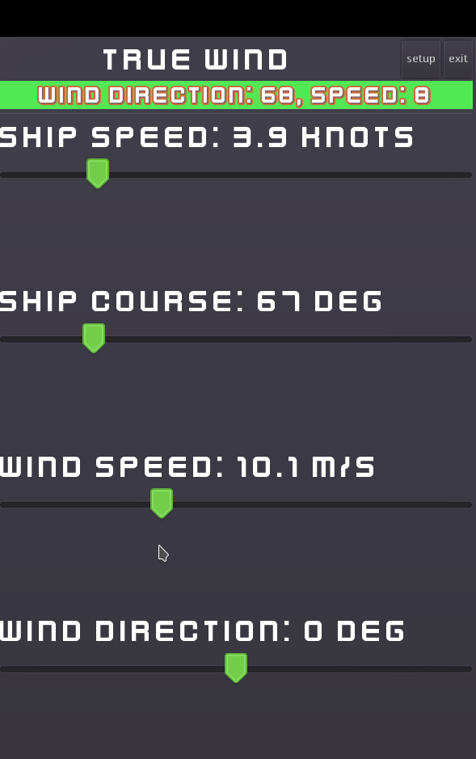

## **TrueWindCalc**

---

## **Оглавление**

- [**TrueWindCalc**](#truewindcalc)
- [**Оглавление**](#оглавление)
  - [**Проект TrueWindCalc**](#проект-truewindcalc)
    - [**Технологии:**](#технологии)
  - [**Запуск проекта**](#запуск-проекта)
- [**Автор**](#автор)

---

### **Проект TrueWindCalc**

Программа для расчета истинного ветра на движущемся судне. Для этого происходит векторное вычитание скорости судна из направления вымпельного ветра. Такой расчет необходим для эффективного использования парусного вооружения и нужд надводного флота. Приложение создано с использованием игрового движка Godot.

#### **Технологии:**

- 

---

### **Запуск проекта**

- скачать и установить игровой движок [Godot 3.5](https://godotengine.org/download/3.x/)
- скачать или клонировать репозиторий программы
- в игровом движке импортировать проект
- чтобы экспортировать проект под нужную платформу смотреть [документацию](https://docs.godotengine.org/ru/stable/tutorials/export/exporting_basics.html#exporting-by-platform)

## **Автор**

_[Александр Андреевич](https://github.com/Zolibot)_

